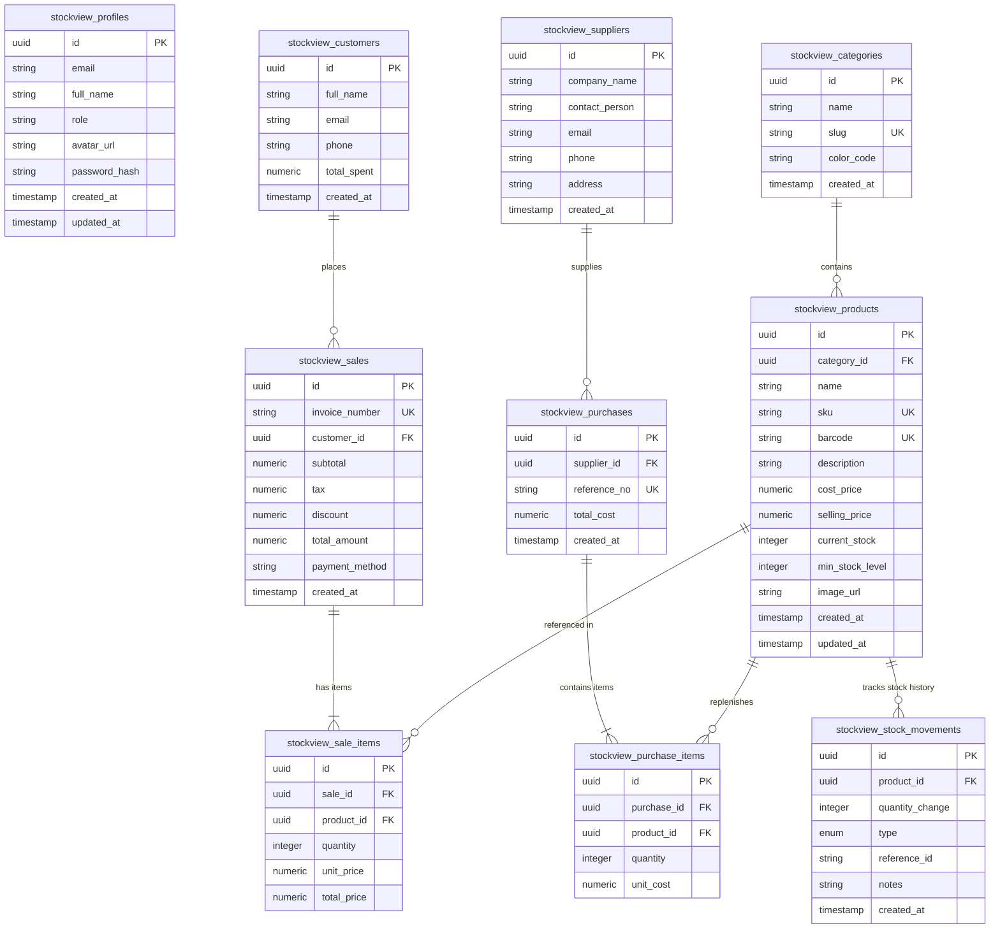

# ⚡ StockView — Enterprise Modern Stock & POS System

[](https://angular.dev/)
[](https://rxjs.dev/)
[](https://tailwindcss.com/)
[](https://supabase.com/)
[](https://www.typescriptlang.org/)

**StockView** is an enterprise-grade, high-performance inventory management and Point of Sale (POS) web application designed with Angular 21, RxJS, and Tailwind CSS v4. Built with a **Wickret & Cuberto-inspired Glassmorphism UI**, it features dynamic multi-theme support (Dark Obsidian & Crisp Light), real-time Supabase integration, automated PostgreSQL inventory triggers, reactive facade state management, and instant export tools (PDF invoices & Excel reporting).

---

## 📑 Table of Contents

1. [Features & Key Highlights](#-features--key-highlights)
2. [Architectural Overview](#-architectural-overview)
3. [Database Architecture & Entity Relationships](#-database-architecture--entity-relationships)
4. [Deep Dive: Angular Implementation](#-deep-dive-angular-implementation)
5. [Deep Dive: Reactive RxJS Architecture](#-deep-dive-reactive-rxjs-architecture)
6. [Deep Dive: CSS, SCSS & Design System](#-deep-dive-css-scss--design-system)
7. [Deep Dive: State Management & Facade Pattern](#-deep-dive-state-management--facade-pattern)
8. [Installation & Project Setup](#-installation--project-setup)
9. [Database Migration & Supabase Setup](#-database-migration--supabase-setup)
10. [Folder Structure](#-folder-structure)

---

## ✨ Features & Key Highlights

- 🛒 **Point of Sale (POS) Checkout**: Real-time cart calculations, subtotal, 8% sales tax, discount deduction, payment method selection, and barcode search.
- 📦 **Inventory & Product Management**: Live stock tracking, SKU generation, barcode lookup, low-stock threshold alerts, category filtering, and modal CRUD operations.
- 🔄 **Automated Stock Adjustments**: PostgreSQL trigger-based inventory updates for sales and purchase orders, plus manual adjustment logging with mandatory audit reason logging.
- 📊 **Analytics & Interactive Dashboard**: Dynamic revenue tracking, stock valuation, movement timelines, recent transactions, and low-stock alerts.
- 📄 **PDF Invoice & Excel Export Engine**: Client-side instant vector PDF generation with `jsPDF` / `jspdf-autotable` and tabular spreadsheet exports via `XLSX`.
- 🎨 **Adaptive Theme Engine**: Instant transition between **Obsidian Dark Mode** and **Crisp Light Theme** using Angular Signals and CSS design tokens.
- ⚡ **Supabase Realtime Sync & Local Fallback**: Seamless real-time data streaming via Supabase WebSocket channels with full offline fallback capabilities.

---

## 🏛 Architectural Overview

StockView follows **Clean Architecture** and **Unidirectional Data Flow** principles. The application is strictly divided into four distinct layers:

```
┌─────────────────────────────────────────────────────────────────┐
│                    Presentation Layer (UI)                      │
│   (Standalone Angular Components, TailwindCSS & Glass Tokens)   │
└────────────────────────────────┬────────────────────────────────┘
                                 │ Observables ($) & Signals ()
                                 ▼
┌─────────────────────────────────────────────────────────────────┐
│                     Facade State Layer                          │
│   (ProductFacade, PosFacade, StockFacade, DashboardFacade)      │
└────────────────────────────────┬────────────────────────────────┘
                                 │ Async Operations & RxJS Pipes
                                 ▼
┌─────────────────────────────────────────────────────────────────┐
│                    Core Infrastructure Layer                    │
│   (SupabaseService, AuthService, ThemeService, PdfExport)       │
└────────────────────────────────┬────────────────────────────────┘
                                 │ Realtime SQL & RPC Calls
                                 ▼
┌─────────────────────────────────────────────────────────────────┐
│                Database & Persistence Layer                     │
│    (Supabase PostgreSQL, Automated Triggers, LocalStorage)      │
└─────────────────────────────────────────────────────────────────┘
```

---

## 🗄 Database Architecture & Entity Relationships

The backend uses a PostgreSQL schema hosted on **Supabase** with prefix `stockview_`. Automated database triggers handle real-time inventory incrementing and decrementing upon transaction creation.

### Database Entity-Relationship Diagram (ERD)



### Automated Database Triggers & Realtime Logic

1. **Sale Stock Decrement Trigger (`trigger_stockview_sale_stock_update`)**:
   - Executes `AFTER INSERT` on `stockview_sale_items`.
   - Decrements `current_stock` in `stockview_products` by `NEW.quantity`.
   - Automatically inserts a record into `stockview_stock_movements` with type `'sale'`.

2. **Purchase Order Stock Increment Trigger (`trigger_stockview_purchase_stock_update`)**:
   - Executes `AFTER INSERT` on `stockview_purchase_items`.
   - Increments `current_stock` in `stockview_products` by `NEW.quantity`.
   - Automatically logs a stock movement record with type `'purchase'`.

---

## 🅰 Deep Dive: Angular Implementation

StockView is built on **Angular 21**, utilizing the modern **Standalone Components Paradigm**, **Angular Signals**, and **Functional Route Guards**.

### Key Architectural Concepts Used:

1. **Standalone Components & Modern Control Flow**:
   - All components are declared with `standalone: true`, eliminating legacy `NgModules`.
   - Template logic utilizes Angular's `@if`, `@for`, and `@switch` syntax for clean rendering performance.

   ```typescript
   @Component({
     selector: 'app-pos',
     standalone: true,
     imports: [CommonModule, FormsModule, LucideAngularModule],
     templateUrl: './pos.component.html'
   })
   export class PosComponent implements OnInit { ... }
   ```

2. **Angular Signals (`signal` & `computed`)**:
   - Used for fine-grained UI reactivity and instant local view updates without unnecessary template dirty checking.
   - Example from [`PosFacadeService`](file:///c:/Users/nnadi/Documents/Work/React%20Projects/stockview/src/app/facades/pos.facade.ts):

   ```typescript
   // Signals for reactive local state
   public customerNameSignal = signal<string>('Walk-in Customer');
   public discountAmountSignal = signal<number>(0);

   // Derived State via computed signals
   public cartSubtotalSignal = computed(() => 
     this.cartSubject.getValue().reduce((acc, item) => acc + item.total_price, 0)
   );

   public cartTaxSignal = computed(() => 
     Number((this.cartSubtotalSignal() * 0.08).toFixed(2))
   );

   public cartGrandTotalSignal = computed(() => {
     const total = this.cartSubtotalSignal() + this.cartTaxSignal() - this.discountAmountSignal();
     return Math.max(0, Number(total.toFixed(2)));
   });
   ```

3. **Functional Route Guards**:
   - Route protection is implemented using functional `CanActivateFn` guards in [`app.routes.ts`](file:///c:/Users/nnadi/Documents/Work/React%20Projects/stockview/src/app/app.routes.ts):

   ```typescript
   export const authGuard: CanActivateFn = () => {
     const authService = inject(AuthService);
     const router = inject(Router);
     
     if (authService.currentUser) return true;
     return router.createUrlTree(['/login']);
   };
   ```

4. **Component Composition & Layout System**:
   - `MainLayoutComponent` acts as a structural shell integrating `SidebarComponent`, `NavbarComponent`, `CommandPaletteComponent` (Cmd+K modal), and `NotificationDrawerComponent`.

---

## 🔄 Deep Dive: Reactive RxJS Architecture

RxJS handles asynchronous streams, debouncing search inputs, state broadcasts, dynamic state filtering, and Supabase data pipelines.

### Key RxJS Patterns & Operators Used:

1. **State Storage with `BehaviorSubject`**:
   - Holds persistent application state (products, cart items, user profile, theme mode) accessible asynchronously via `.asObservable()`.

2. **Stream Combination & Reactive Filtering (`combineLatest`)**:
   - In [`ProductFacadeService`](file:///c:/Users/nnadi/Documents/Work/React%20Projects/stockview/src/app/facades/product.facade.ts), `products$` combines multiple input streams (search query, selected category, status filter, product list) to yield real-time filtered results without manual subscriptions:

   ```typescript
   const debouncedSearch$ = this.searchTermSubject.pipe(
     debounceTime(300),
     distinctUntilChanged()
   );

   this.products$ = combineLatest([
     this.productsSubject.asObservable(),
     debouncedSearch$,
     this.selectedCategorySubject.asObservable(),
     this.selectedStatusSubject.asObservable()
   ]).pipe(
     map(([products, search, catId, status]) => {
       let filtered = products;

       if (search && search.trim() !== '') {
         const query = search.toLowerCase().trim();
         filtered = filtered.filter(p =>
           p.name.toLowerCase().includes(query) ||
           p.sku.toLowerCase().includes(query) ||
           (p.barcode && p.barcode.toLowerCase().includes(query))
         );
       }

       if (catId && catId !== 'ALL') {
         filtered = filtered.filter(p => p.category_id === catId);
       }

       if (status && status !== 'ALL') {
         if (status === 'LOW_STOCK') {
           filtered = filtered.filter(p => p.current_stock <= p.min_stock_alert);
         } else {
           filtered = filtered.filter(p => p.status === status);
         }
       }

       return filtered;
     }),
     shareReplay(1)
   );
   ```

3. **Supabase Promise to Observable Conversion (`from`)**:
   - Converts Supabase SDK async promises into RxJS streams with `map`, `catchError`, and `of` fallbacks:

   ```typescript
   from(this.supabase.client.from('stockview_products').select('*, category:stockview_categories(*)'))
     .pipe(
       map(({ data, error }) => (error || !data) ? this.fallbackProducts : data),
       catchError(() => of(this.fallbackProducts))
     )
     .subscribe(products => this.productsSubject.next(products));
   ```

---

## 🎨 Deep Dive: CSS, SCSS & Design System

StockView uses a custom-tailored **Wickret Dark/Light Glassmorphism System** built on **TailwindCSS 4** and native CSS variables.

### Design Tokens & Custom CSS Properties

```css
:root {
  --bg-obsidian-950: #050608;
  --bg-obsidian-900: #090a0f;
  --bg-obsidian-850: #0f1118;
  --bg-obsidian-800: #151824;
  --border-wickret: rgba(255, 255, 255, 0.08);
  --border-wickret-hover: rgba(124, 58, 237, 0.4);
  --brand-violet: #7c3aed;
  --brand-indigo: #6366f1;
  --brand-emerald: #10b981;
  --brand-cyan: #06b6d4;
  --brand-amber: #f59e0b;
  --brand-rose: #f43f5e;
}
```

### Glassmorphism & Micro-Interactions

```css
/* Glass Panel with Backdrop Filter Blur */
.glass-panel {
  background: rgba(15, 17, 24, 0.85) !important;
  backdrop-filter: blur(24px);
  -webkit-backdrop-filter: blur(24px);
  border: 1px solid rgba(255, 255, 255, 0.08) !important;
  box-shadow: 0 12px 40px 0 rgba(0, 0, 0, 0.5);
}

/* Glass Card with Glowing Violet Hover State */
.glass-card {
  background: linear-gradient(135deg, rgba(255, 255, 255, 0.04) 0%, rgba(255, 255, 255, 0.01) 100%) !important;
  backdrop-filter: blur(16px);
  border: 1px solid rgba(255, 255, 255, 0.08) !important;
  transition: all 0.3s cubic-bezier(0.4, 0, 0.2, 1);
}

.glass-card:hover {
  border-color: rgba(124, 58, 237, 0.4) !important;
  box-shadow: 0 0 30px -5px rgba(124, 58, 237, 0.25);
  transform: translateY(-2px);
}
```

### Seamless Light Theme Overrides

Theme switching is handled dynamically without page reload by placing the `.light` class on `document.documentElement` and `document.body` via [`ThemeService`](file:///c:/Users/nnadi/Documents/Work/React%20Projects/stockview/src/app/core/services/theme.service.ts):

```css
html.light body,
.light body {
  background-color: #f8fafc !important;
  color: #0f172a !important;
}

html.light .glass-panel,
.light .glass-panel {
  background: rgba(255, 255, 255, 0.92) !important;
  border-color: rgba(226, 232, 240, 0.9) !important;
  box-shadow: 0 10px 30px -5px rgba(15, 23, 42, 0.06) !important;
}
```

---

## 🏛 Deep Dive: State Management & Facade Pattern

State management in StockView avoids bulky boilerplate libraries (like NgRx) while preserving **predictable unidirectional state flow** through the **Facade Pattern**.

### State Flow Diagram

```mermaid
flowchart TD
    subgraph UI_Layer ["Presentation Component (View)"]
        UserAction["User Action (Search / Checkout / Edit)"]
        AsyncPipe["Async Pipe ($) / Signal Call ()"]
    end

    subgraph Facade_Layer ["Facade Service Layer"]
        ProductFacade["ProductFacadeService"]
        PosFacade["PosFacadeService"]
        StockFacade["StockFacadeService"]
        
        SubjectState["BehaviorSubject State<T>"]
        SignalState["Angular Signal State<T>"]
        CombinedPipeline["RxJS Pipe (combineLatest, debounce, map)"]
    end

    subgraph Infrastructure_Layer ["Core & Backend Services"]
        SupabaseService["SupabaseService (Realtime / REST)"]
        LocalStorage["Browser LocalStorage (Fallback / Session)"]
        PostgreSQL["Supabase PostgreSQL DB & Triggers"]
    end

    UserAction -->|Invokes Method| ProductFacade
    UserAction -->|Invokes Method| PosFacade
    
    ProductFacade -->|Mutates State| SubjectState
    ProductFacade -->|Updates Signal| SignalState
    PosFacade -->|Processes Transaction| SupabaseService
    
    SupabaseService -->|Persists Data| PostgreSQL
    PostgreSQL -->|Fires Triggers| PostgreSQL
    SupabaseService -->|Fallback Persist| LocalStorage

    SubjectState --> CombinedPipeline
    CombinedPipeline -->|Exposes Observable $| AsyncPipe
    SignalState -->|Exposes Signal ()| AsyncPipe
    AsyncPipe -->|Re-renders UI| UI_Layer
```

### Facade Services Breakdown:

| Facade Service | Managed State & Responsibilities | Key Reactivity Mechanics |
| :--- | :--- | :--- |
| **`ProductFacadeService`** | Products list, categories, low-stock threshold alerts, search queries, status filters. | `BehaviorSubject`, `combineLatest`, `shareReplay`, `signal` |
| **`PosFacadeService`** | POS cart items, customer selection, discounts, payment method, transaction checkout. | `BehaviorSubject<CartItem[]>`, `computed` signals (`cartGrandTotalSignal`) |
| **`StockFacadeService`** | Inventory movement logs, manual stock adjustments, purchase orders, supplier profiles. | `BehaviorSubject`, automatic stock level sync via `ProductFacade` |
| **`DashboardFacadeService`**| Dashboard metrics, revenue aggregation, quick action stats, stock valuation totals. | Reactive aggregation from `ProductFacade`, `PosFacade`, `StockFacade` |
| **`AuthService`** | Authenticated user profile, session persistence, instant login/signup validation. | `BehaviorSubject<UserProfile>`, `signal<UserProfile>`, `localStorage` sync |
| **`ThemeService`** | Theme mode (`dark` \| `light`), DOM class application. | `signal<ThemeMode>`, DOM mutation effect, `localStorage` persistence |

---

## ⚙️ Installation & Project Setup

### Prerequisites

- **Node.js**: v18.0.0 or higher
- **npm**: v9.0.0 or higher
- **Angular CLI**: v21.2.0 (`npm i -g @angular/cli`)

### Installation Steps

1. **Clone the Repository**:
   ```bash
   git clone https://github.com/lambo10/stockview.git
   cd stockview
   ```

2. **Install Dependencies**:
   ```bash
   npm install
   ```

3. **Development Server**:
   Run the local development server:
   ```bash
   ng serve
   ```
   Navigate to `http://localhost:4200/`. The application will automatically reload if you change any source files.

4. **Production Build**:
   To compile and optimize the application for production:
   ```bash
   ng build
   ```
   Build artifacts will be generated in the `dist/` directory.

---

## 🗄 Database Migration & Supabase Setup

To set up your own Supabase instance with automatic stock calculation triggers:

1. Open your **Supabase Dashboard** -> **SQL Editor**.
2. Run the SQL script found in [`supabase_wickret_migration.sql`](file:///c:/Users/nnadi/Documents/Work/React%20Projects/stockview/supabase_wickret_migration.sql).
3. The script creates all `stockview_*` tables, PostgreSQL functions, stock drop/gain triggers, enables real-time publication, and seeds initial data.

---

## 📁 Folder Structure

```
stockview/
├── public/                     # Static public assets & icons
├── src/
│   ├── app/
│   │   ├── core/               # Core Singleton Services & Models
│   │   │   ├── config/         # App constants & configuration
│   │   │   ├── guards/         # Auth & route functional guards
│   │   │   ├── models/         # TypeScript interfaces & domain models
│   │   │   └── services/       # Auth, Supabase, Theme & PDF Export services
│   │   ├── facades/            # Reactive Facade State Management Layer
│   │   │   ├── dashboard.facade.ts
│   │   │   ├── pos.facade.ts
│   │   │   ├── product.facade.ts
│   │   │   └── stock.facade.ts
│   │   ├── features/           # Feature Module Components
│   │   │   ├── auth/           # Login & Registration views
│   │   │   ├── customers/      # Customer directory
│   │   │   ├── dashboard/      # Analytics overview & quick stats
│   │   │   ├── pos/            # Point of Sale interactive checkout
│   │   │   ├── products/       # Inventory listing & modal forms
│   │   │   ├── reports/        # PDF & Excel export center
│   │   │   ├── stock/          # Stock movements & Purchase Orders
│   │   │   └── suppliers/      # Supplier management
│   │   ├── layout/             # Shell Layout Components
│   │   │   ├── command-palette/# Cmd+K quick navigation search modal
│   │   │   ├── main-layout/    # Main shell container
│   │   │   ├── navbar/         # Header with profile & theme toggle
│   │   │   ├── notification-drawer/ # Low stock alerts drawer
│   │   │   └── sidebar/        # Collapsible side navigation
│   │   ├── app.config.ts       # Application providers & router configuration
│   │   ├── app.routes.ts       # Standalone routing table
│   │   └── app.ts              # Root component
│   ├── styles.css              # Custom TailwindCSS v4 & Glassmorphism system
│   ├── main.ts                 # Bootstrap application main entry
│   └── index.html              # HTML5 entry point
├── supabase_wickret_migration.sql # Full Database Schema & Triggers Migration
├── angular.json                # Angular CLI configuration
├── package.json                # Dependencies & scripts
└── README.md                   # Detailed Project Documentation
```

---

<p center="text-center">
Built with ❤️ using <strong>Angular 21</strong>, <strong>RxJS</strong>, <strong>Tailwind CSS v4</strong> & <strong>Supabase</strong>.
</p>
